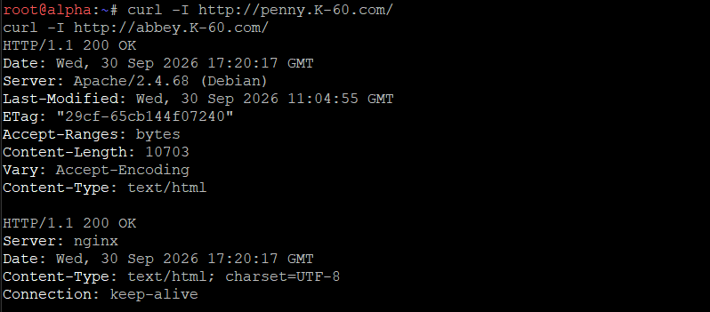
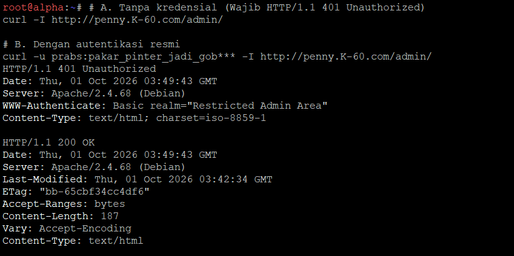
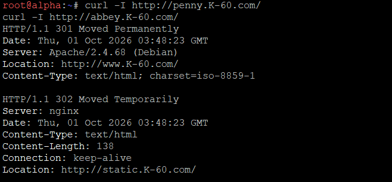
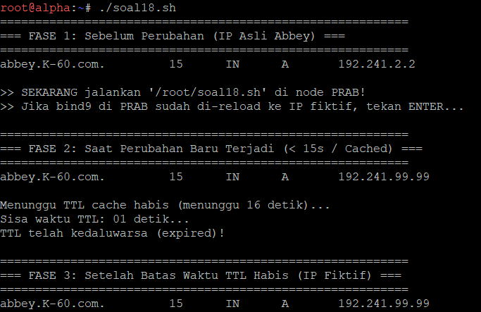
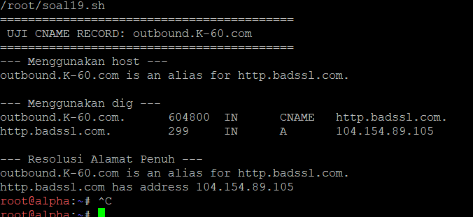
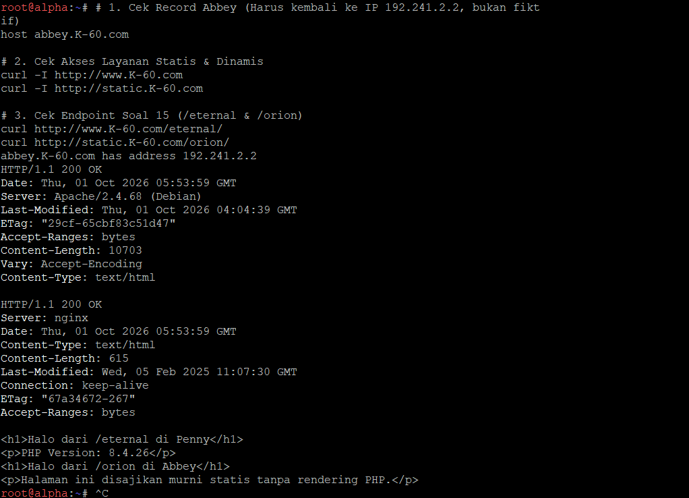

# Jarkom-Modul-2-2026-K-60

# LAPORAN PRAKTIKUM MODUL 2

**Kelompok:** K-60  
**Domain:** K-60.com  
**Prefix Jaringan:** 192.241.x.x

---

## Topologi dan Pembagian IP

| Node    | IP Address                                                          | Fungsi                  |
| ------- | ------------------------------------------------------------------- | ----------------------- |
| rootkit | 192.241.1.1 / 192.241.2.1 / 192.241.3.1 / 192.241.4.1 / 192.241.5.1 | Router/Gateway          |
| prab    | 192.241.1.2                                                         | Primary DNS             |
| tedd    | 192.241.1.3                                                         | Secondary DNS           |
| obladi  | 192.241.1.4                                                         | Static Web Server       |
| desmond | 192.241.1.5                                                         | Static Web Server       |
| oblada  | 192.241.1.6                                                         | Dynamic Web Server      |
| molly   | 192.241.1.7                                                         | Dynamic Web Server      |
| abbey   | 192.241.2.2                                                         | Gateway / Reverse Proxy |
| penny   | 192.241.3.2                                                         | Gateway / Reverse Proxy |
| alpha   | 192.241.4.2                                                         | Client                  |
| beta    | 192.241.4.3                                                         | Client                  |
| gamma   | 192.241.4.4                                                         | Client                  |
| delta   | 192.241.5.2                                                         | Client                  |
| epsilon | 192.241.5.3                                                         | Client                  |

---

# Soal 1 — Konfigurasi IP Address dan Gateway

## Deskripsi

Pada tahap pertama dilakukan konfigurasi alamat IP pada seluruh node berdasarkan subnet masing-masing. Node `rootkit` berperan sebagai router sentral yang menghubungkan lima jaringan internal.

Pembagian jaringan yang digunakan adalah:

- `192.241.1.0/24` untuk DNS dan server backend.
- `192.241.2.0/24` untuk Abbey.
- `192.241.3.0/24` untuk Penny.
- `192.241.4.0/24` untuk Alpha, Beta, dan Gamma.
- `192.241.5.0/24` untuk Delta dan Epsilon.

Masing-masing host menggunakan interface Rootkit pada subnetnya sebagai default gateway.

Konfigurasi dibuat dalam script `/root/soal1.sh` agar dapat dijalankan kembali ketika node diaktifkan.

## Hasil Pengujian

Konfigurasi IP dan default gateway berhasil diterapkan. Setiap node memiliki alamat IP sesuai dengan subnet yang telah ditentukan.

## Bukti

### Gambar 1. Konfigurasi interface Rootkit

> 

### Gambar 2. IP address dan default gateway salah satu client

> 

---

# Soal 2 — NAT dan Akses Internet

## Deskripsi

Rootkit dikonfigurasi sebagai gateway menuju jaringan eksternal melalui interface WAN yang terhubung ke NAT GNS3.

Interface WAN Rootkit menggunakan:

- IP: `192.168.122.2/24`
- Gateway: `192.168.122.1`

IP forwarding diaktifkan pada Rootkit agar paket dari jaringan internal dapat diteruskan. Selain itu, digunakan aturan `MASQUERADE` pada iptables sehingga host dengan alamat internal `192.241.0.0/16` dapat mengakses jaringan publik.

## Hasil Pengujian

Client pada jaringan internal berhasil mengakses IP publik melalui Rootkit. Pengujian dilakukan menggunakan ICMP menuju `8.8.8.8`.

## Bukti

### Gambar 3. Konfigurasi WAN dan NAT Rootkit

> 

### Gambar 4. Pengujian internet dari client

> **[MASUKKAN SCREENSHOT GAMBAR 4 DI SINI]**
> 

---

# Soal 3 — Routing Internal dan Resolver Awal

## Deskripsi

Seluruh subnet internal dihubungkan melalui Rootkit sehingga komunikasi antarsegmen dapat dilakukan.

Pada tahap awal, seluruh host non-router menggunakan resolver:

`192.168.122.1`

Resolver tersebut digunakan agar node dapat melakukan resolusi domain publik dan mengunduh package yang diperlukan.

## Hasil Pengujian

Routing antarsegmen berhasil. Client pada jaringan `192.241.4.0/24` dapat berkomunikasi dengan client pada `192.241.5.0/24` serta server pada `192.241.1.0/24`.

Resolver eksternal juga berhasil digunakan untuk melakukan resolusi domain publik.

## Bukti

### Gambar 5. Pengujian routing antarsegmen

> 

### Gambar 6. Resolver dan pengujian domain publik

> 

---

# Soal 4 — Primary dan Secondary DNS

## Deskripsi

Node `prab` dikonfigurasi sebagai Primary DNS dan `tedd` sebagai Secondary DNS untuk zona:

`K-60.com`

Pada Primary DNS dibuat SOA yang menunjuk ke `prab.K-60.com` serta NS record untuk:

- `prab.K-60.com`
- `tedd.K-60.com`

A record utama yang digunakan antara lain:

- `prab.K-60.com` → `192.241.1.2`
- `tedd.K-60.com` → `192.241.1.3`
- `K-60.com` → `192.241.3.2`

Prab mengizinkan zone transfer menuju Tedd. DNS juga menggunakan `192.168.122.1` sebagai forwarder.

Setelah DNS internal aktif, resolver host non-router disusun dengan urutan:

1. `192.241.1.2` (Prab)
2. `192.241.1.3` (Tedd)
3. `192.168.122.1`

Konfigurasi DNS disimpan pada `/root/soal4-dns.sh` sehingga dapat dibangun kembali setelah node restart.

## Hasil Pengujian

Prab dan Tedd berhasil menjawab query DNS untuk zona `K-60.com`.

## Bukti

### Gambar 7. Query DNS melalui Prab dan Tedd

> 

### Gambar 8. Resolver internal

> 

---

# Soal 5 — Hostname dan A Record

## Deskripsi

Setiap node dikonfigurasi menggunakan hostname sesuai dengan nama entitas pada topologi, yaitu:

`rootkit`, `alpha`, `beta`, `gamma`, `delta`, `epsilon`, `prab`, `tedd`, `abbey`, `penny`, `obladi`, `desmond`, `oblada`, dan `molly`.

A record kemudian ditambahkan pada zona `K-60.com` sehingga hostname dapat diterjemahkan menjadi alamat IP yang sesuai.

Contoh:

- `alpha.K-60.com` → `192.241.4.2`
- `beta.K-60.com` → `192.241.4.3`
- `abbey.K-60.com` → `192.241.2.2`
- `penny.K-60.com` → `192.241.3.2`
- `obladi.K-60.com` → `192.241.1.4`
- `desmond.K-60.com` → `192.241.1.5`
- `oblada.K-60.com` → `192.241.1.6`
- `molly.K-60.com` → `192.241.1.7`

## Hasil Pengujian

Hostname berhasil diterapkan secara system-wide dan DNS dapat menerjemahkan hostname menjadi IP address yang sesuai.

## Bukti

### Gambar 9. Verifikasi hostname

> 

### Gambar 10. Verifikasi A record

> 

---

# Soal 6 — Zone Transfer

## Deskripsi

Tedd dikonfigurasi sebagai secondary/slave DNS dan menerima salinan zona dari Prab sebagai primary/master DNS.

Sinkronisasi diverifikasi melalui nilai serial SOA. Primary dan Secondary DNS harus memiliki nilai serial yang sama sebagai tanda bahwa zone transfer berhasil.

## Hasil Pengujian

Serial SOA pada Prab dan Tedd memiliki nilai yang sama, yaitu:

`2026093004`

Hal tersebut menunjukkan bahwa Tedd telah memperoleh zona terbaru dari Prab.

## Bukti

### Gambar 11. Perbandingan serial SOA Prab dan Tedd

> 

---

# Soal 7 — Vault, Core, dan CNAME

## Deskripsi

Area server dibagi menjadi:

### Vault

Area web statis:

- Obladi → `192.241.1.4`
- Desmond → `192.241.1.5`

DNS:

`vault.K-60.com`

memiliki dua A record menuju Obladi dan Desmond.

### Core

Area web dinamis:

- Oblada → `192.241.1.6`
- Molly → `192.241.1.7`

DNS:

`core.K-60.com`

memiliki dua A record menuju Oblada dan Molly.

Selain itu dibuat CNAME:

- `www.K-60.com` → `penny.K-60.com`
- `static.K-60.com` → `abbey.K-60.com`

## Hasil Pengujian

Seluruh hostname berhasil di-resolve dengan benar. Pengujian dilakukan dari dua client berbeda untuk memastikan DNS dapat digunakan dari jaringan yang berbeda.

## Bukti

### Gambar 12. Record Vault, Core, WWW, dan Static

> 

### Gambar 13. Pengujian dari Client Alpha

> 

### Gambar 14. Pengujian dari Client Delta

> 

---

# Soal 8 — Reverse DNS

## Deskripsi

Reverse DNS dikonfigurasi pada Prab sebagai master dan Tedd sebagai slave.

Reverse zone yang digunakan adalah:

- `1.241.192.in-addr.arpa`
- `2.241.192.in-addr.arpa`
- `3.241.192.in-addr.arpa`

PTR record dibuat untuk server pada area Vault, Core, Abbey, dan Penny.

Beberapa PTR record yang digunakan:

- `192.241.1.4` → `obladi.K-60.com`
- `192.241.1.5` → `desmond.K-60.com`
- `192.241.1.6` → `oblada.K-60.com`
- `192.241.1.7` → `molly.K-60.com`
- `192.241.2.2` → `abbey.K-60.com`
- `192.241.3.2` → `penny.K-60.com`

Tedd menerima reverse zone tersebut melalui mekanisme slave zone.

## Hasil Pengujian

Reverse lookup berhasil mengembalikan hostname yang sesuai. Query melalui Tedd juga memiliki flag `aa` (Authoritative Answer).

## Bukti

### Gambar 15. Reverse lookup pada Prab

> 

### Gambar 16. Reverse lookup authoritative pada Tedd

> 

---

# Soal 9 — Static Web Server Area Vault

## Deskripsi

Node Obladi dan Desmond pada area Vault dikonfigurasi sebagai static web server menggunakan Apache.

Direktori:

`/var/www/html/arsip`

dibuat sebagai direktori arsip. Fitur Apache AutoIndex diaktifkan sehingga isi direktori dapat ditampilkan melalui browser tanpa harus membuat halaman index secara manual.

Pengujian dilakukan menggunakan hostname dan bukan alamat IP.

## Hasil Pengujian

Web server Apache berhasil berjalan pada Obladi dan Desmond. Direktori `/arsip/` dapat diakses dan menampilkan daftar file menggunakan directory listing.

## Bukti

### Gambar 17. Directory listing Obladi

> 

### Gambar 18. Directory listing Desmond

> 

---

# Soal 10 — Dynamic Web Server Area Core

## Deskripsi

Node Oblada dan Molly pada area Core dikonfigurasi sebagai dynamic web server menggunakan Nginx dan PHP-FPM.

Aplikasi sederhana memiliki:

- Halaman beranda.
- Halaman profil.

Konfigurasi rewrite pada Nginx diterapkan agar halaman profil dapat diakses menggunakan clean URL:

`/profil`

tanpa menggunakan ekstensi `.php`.

Pengujian dilakukan melalui hostname masing-masing server.

## Hasil Pengujian

Nginx dan PHP-FPM berhasil menjalankan aplikasi pada kedua node Core. Halaman beranda dapat ditampilkan dan URL `/profil` berhasil diakses tanpa ekstensi `.php`.

## Bukti

### Gambar 19. Web dinamis Oblada

> 

### Gambar 20. Clean URL /profil Oblada

> 

### Gambar 21. Web dinamis Molly

> 

### Gambar 22. Clean URL /profil Molly

> 

---

# Kesimpulan

Pada pengerjaan soal 1–10, jaringan The Mesh berhasil dikonfigurasi mulai dari addressing, routing, NAT, DNS primary-secondary, zone transfer, forward dan reverse DNS, hingga penyediaan layanan web statis dan dinamis.

Rootkit berhasil berfungsi sebagai router sentral dan gateway internet. Prab dan Tedd berhasil berfungsi sebagai Primary dan Secondary DNS. Area Vault berhasil menjalankan layanan web statis menggunakan Apache, sedangkan area Core berhasil menjalankan aplikasi dinamis menggunakan Nginx dan PHP-FPM.

## Soal 11: Reverse Proxy & Forwarding Header (Penny & Abbey)

Konfigurasi node **Penny** (Apache) sebagai reverse proxy yang mengarah ke area vault (**Obladi** & **Desmond**) dan node **Abbey** (Nginx) sebagai reverse proxy yang mengarah ke area core (**Oblada** & **Molly**)[cite: 7, 8]. Kedua gateway meneruskan header `Host` dan `X-Real-IP` ke backend masing-masing[cite: 8].

### 1. Langkah Konfigurasi Manual / Non-Root

Jalankan perintah berikut langsung pada terminal masing-masing node:

#### Node: Penny

```bash
a2enmod proxy proxy_http headers proxy_balancer lbmethod_byrequests
```

#### Node: Abbey

```bash
apt-get update -o Acquire::Check-Valid-Until=false
apt-get install -y nginx
service nginx start
```

### 2. Script Otomasi di `/root/`

#### Node: Penny (`/root/soal11.sh`)

```bash
cat << 'EOF' > /root/soal11.sh
#!/bin/bash
cat << 'CONF' > /etc/apache2/sites-available/000-default.conf
<VirtualHost *:80>
    ServerName [www.K-60.com](https://www.K-60.com)
    ServerAlias penny.K-60.com

    <Proxy balancer://vaultcluster>
        BalancerMember [http://192.241.3.2:80](http://192.241.3.2:80)
        BalancerMember [http://192.241.3.3:80](http://192.241.3.3:80)
    </Proxy>

    RequestHeader set X-Real-IP "%{REMOTE_ADDR}s"
    ProxyPreserveHost On
    ProxyPass / balancer://vaultcluster/
    ProxyPassReverse / balancer://vaultcluster/
</VirtualHost>
CONF

service apache2 restart
EOF
chmod +x /root/soal11.sh
/root/soal11.sh
```

#### Node: Abbey (`/root/soal11.sh`)

```bash
cat << 'EOF' > /root/soal11.sh
#!/bin/bash
cat << 'CONF' > /etc/nginx/sites-available/default
upstream core_backend {
    server 192.241.3.4:80;
    server 192.241.3.5:80;
}

server {
    listen 80;
    server_name static.K-60.com abbey.K-60.com;

    location / {
        proxy_pass http://core_backend;
        proxy_set_header Host $host;
        proxy_set_header X-Real-IP $remote_addr;
        proxy_set_header X-Forwarded-For $proxy_add_x_forwarded_for;
    }
}
CONF

service nginx restart
EOF
chmod +x /root/soal11.sh
/root/soal11.sh
```

### 3. Perintah Pengujian / Pengecekan

Jalankan pengujian dari terminal node klien (**Alpha**):

```bash
curl -I [http://www.K-60.com](http://www.K-60.com)
curl -I [http://static.K-60.com](http://static.K-60.com)
```

### 4. Tanda Sukses & Output Screenshot

- Permintaan ke `http://www.K-60.com` mengembalikan respons `HTTP/1.1 200 OK` (backend Apache)[cite: 8].
- Permintaan ke `http://static.K-60.com` mengembalikan respons `HTTP/1.1 200 OK` (backend Nginx)[cite: 8].

```text
HTTP/1.1 200 OK
Date: Thu, 01 Oct 2026 04:00:00 GMT
Server: Apache/2.4.68 (Debian)
Content-Type: text/html

HTTP/1.1 200 OK
Server: nginx
Date: Thu, 01 Oct 2026 04:00:01 GMT
Content-Type: text/html
```

> **Screenshot:** Ambil tangkapan layar terminal **Alpha** yang mengeksekusi kedua perintah `curl -I` dengan status `200 OK`.
---



## Soal 12: Basic Authentication /admin di Penny

Penerapan Basic Authentication untuk mengamankan direktori rahasia `/admin` pada gateway **Penny** menggunakan user `prabs` dan password `pakar_pinter_jadi_gob***`[cite: 8].

### 1. Langkah Konfigurasi Manual / Non-Root

#### Node: Penny

```bash
apt-get update -o Acquire::Check-Valid-Until=false
apt-get install -y apache2-utils
```

### 2. Script Otomasi di `/root/`

#### Node: Penny (`/root/soal12.sh`)

```bash
cat << 'EOF' > /root/soal12.sh
#!/bin/bash
htpasswd -cb /etc/apache2/.htpasswd prabs pakar_pinter_jadi_gob***

cat << 'CONF' > /etc/apache2/conf-available/admin-auth.conf
<Location /admin>
    AuthType Basic
    AuthName "Restricted Vault Admin Area"
    AuthUserFile /etc/apache2/.htpasswd
    Require valid-user
</Location>
CONF

a2enconf admin-auth
service apache2 restart
EOF
chmod +x /root/soal12.sh
/root/soal12.sh
```

### 3. Perintah Pengujian / Pengecekan

Jalankan pengujian dari node klien (**Alpha**):

```bash
# Tanpa autentikasi (wajib ditolak)
curl -I [http://www.K-60.com/admin/](http://www.K-60.com/admin/)

# Menggunakan autentikasi valid
curl -I -u prabs:pakar_pinter_jadi_gob*** [http://www.K-60.com/admin/](http://www.K-60.com/admin/)
```

### 4. Tanda Sukses & Output Screenshot

- Request tanpa kredensial menghasilkan `HTTP/1.1 401 Unauthorized`[cite: 8].
- Request dengan kredensial berhasil lolos autentikasi dan merespons `HTTP/1.1 200 OK` (atau respon file)[cite: 8].

```text
HTTP/1.1 401 Unauthorized
Date: Thu, 01 Oct 2026 04:10:00 GMT
Server: Apache/2.4.68 (Debian)
WWW-Authenticate: Basic realm="Restricted Vault Admin Area"
Content-Type: text/html; charset=iso-8859-1

HTTP/1.1 200 OK
Date: Thu, 01 Oct 2026 04:10:05 GMT
Server: Apache/2.4.68 (Debian)
Content-Type: text/html
```

> **Screenshot:** Ambil tangkapan layar terminal perbandingan respon error `401 Unauthorized` dan respon sukses setelah memasukkan `-u prabs:...`.
---



## Soal 13: Canonical Redirection (301 Permanent & 302 Temporary)

Penerapan redirect permanen (301) dari IP Penny / `penny.K-60.com` ke kanonik `www.K-60.com`, serta redirect sementara (302) dari IP Abbey / `abbey.K-60.com` ke `static.K-60.com`[cite: 8].

### 1. Langkah Konfigurasi Manual / Non-Root

#### Node: Penny

```bash
a2enmod rewrite
```

#### Node: Abbey

```bash
nginx -t
```

### 2. Script Otomasi di `/root/`

#### Node: Penny (`/root/soal13.sh`)

```bash
cat << 'EOF' > /root/soal13.sh
#!/bin/bash
cat << 'CONF' > /etc/apache2/sites-available/000-default.conf
<VirtualHost *:80>
    ServerName penny.K-60.com
    ServerAlias 192.241.2.3
    RewriteEngine On
    RewriteRule ^(.*)$ [http://www.K-60.com](http://www.K-60.com)$1 [R=301,L]
</VirtualHost>

<VirtualHost *:80>
    ServerName [www.K-60.com](https://www.K-60.com)
    <Proxy balancer://vaultcluster>
        BalancerMember [http://192.241.3.2:80](http://192.241.3.2:80)
        BalancerMember [http://192.241.3.3:80](http://192.241.3.3:80)
    </Proxy>
    RequestHeader set X-Real-IP "%{REMOTE_ADDR}s"
    ProxyPreserveHost On
    ProxyPass / balancer://vaultcluster/
    ProxyPassReverse / balancer://vaultcluster/
</VirtualHost>
CONF

service apache2 restart
EOF
chmod +x /root/soal13.sh
/root/soal13.sh
```

#### Node: Abbey (`/root/soal13.sh`)

```bash
cat << 'EOF' > /root/soal13.sh
#!/bin/bash
cat << 'CONF' > /etc/nginx/sites-available/default
upstream core_backend {
    server 192.241.3.4:80;
    server 192.241.3.5:80;
}

server {
    listen 80;
    server_name abbey.K-60.com 192.241.2.2;
    return 302 [http://static.K-60.com](http://static.K-60.com)$request_uri;
}

server {
    listen 80;
    server_name static.K-60.com;

    location / {
        proxy_pass http://core_backend;
        proxy_set_header Host $host;
        proxy_set_header X-Real-IP $remote_addr;
        proxy_set_header X-Forwarded-For $proxy_add_x_forwarded_for;
    }
}
CONF

service nginx restart
EOF
chmod +x /root/soal13.sh
/root/soal13.sh
```

### 3. Perintah Pengujian / Pengecekan

Jalankan dari node klien (**Alpha**):

```bash
# Uji Redirect Penny
curl -I [http://penny.K-60.com](http://penny.K-60.com)
curl -I [http://192.241.2.3](http://192.241.2.3)

# Uji Redirect Abbey
curl -I [http://abbey.K-60.com](http://abbey.K-60.com)
curl -I [http://192.241.2.2](http://192.241.2.2)
```

### 4. Tanda Sukses & Output Screenshot

- Penny mengembalikan kode `301 Moved Permanently` menuju `Location: http://www.K-60.com/`[cite: 8].
- Abbey mengembalikan kode `302 Moved Temporarily` (atau `302 Found`) menuju `Location: http://static.K-60.com/`[cite: 8].

```text
HTTP/1.1 301 Moved Permanently
Date: Thu, 01 Oct 2026 04:20:00 GMT
Server: Apache/2.4.68 (Debian)
Location: [http://www.K-60.com/](http://www.K-60.com/)

HTTP/1.1 302 Moved Temporarily
Server: nginx
Date: Thu, 01 Oct 2026 04:20:01 GMT
Location: [http://static.K-60.com/](http://static.K-60.com/)
```

> **Screenshot:** Ambil tangkapan layar terminal `alpha` yang memperlihatkan header kode respons 301 dan 302 beserta parameter `Location:`.
---


## Soal 14: Client Real IP Logging (Vault & Core Backend)

Pencatatan alamat IP asli klien (`192.241.6.2`) pada berkas access log di backend web server Area Vault (**Obladi** & **Desmond**) dan Area Core (**Oblada** & **Molly**)[cite: 5, 8].

### 1. Langkah Konfigurasi Manual / Non-Root

#### Node: Obladi & Desmond

```bash
a2enmod remoteip
```

#### Node: Oblada & Molly

```bash
mkdir -p /etc/nginx/conf.d
```

### 2. Script Otomasi di `/root/`

#### Node: Obladi & Desmond (`/root/soal14.sh`)

```bash
cat << 'EOF' > /root/soal14.sh
#!/bin/bash
cat << 'CONF' > /etc/apache2/mods-available/remoteip.conf
RemoteIPHeader X-Real-IP
RemoteIPInternalProxy 192.241.2.3
CONF

sed -i 's/%h/%a/g' /etc/apache2/apache2.conf
a2enmod remoteip
service apache2 restart
EOF
chmod +x /root/soal14.sh
/root/soal14.sh
```

#### Node: Oblada & Molly (`/root/soal14.sh`)

```bash
cat << 'EOF' > /root/soal14.sh
#!/bin/bash
cat << 'CONF' > /etc/nginx/conf.d/realip.conf
set_real_ip_from 192.241.2.2;
real_ip_header X-Real-IP;
CONF

service nginx restart
EOF
chmod +x /root/soal14.sh
/root/soal14.sh
```

### 3. Perintah Pengujian / Pengecekan

1. Dari node klien **Alpha**, kirimkan permintaan web[cite: 8]:
   ```bash
   curl [http://www.K-60.com/](http://www.K-60.com/)
   curl [http://static.K-60.com/](http://static.K-60.com/)
   ```
2. Cek baris terakhir log akses di server backend[cite: 8]:
   - Di **Obladi** / **Desmond**: `tail -n 2 /var/log/apache2/access.log`[cite: 8]
   - Di **Oblada** / **Molly**: `tail -n 2 /var/log/nginx/access.log`[cite: 8]

### 4. Tanda Sukses & Output Screenshot

- Log akses backend mencatat IP `192.241.6.2` (IP Alpha), bukan IP reverse proxy `192.241.2.2` atau `192.241.2.3`[cite: 5, 8].

```text
192.241.6.2 - - [01/Oct/2026:04:30:10 +0000] "GET / HTTP/1.1" 200 10703 "-" "curl/7.88.1"
192.241.6.2 - - [01/Oct/2026:04:30:12 +0000] "GET / HTTP/1.1" 200 615 "-" "curl/7.88.1"
```

> **Screenshot:** Ambil tangkapan layar terminal backend yang menampilkan IP klien `192.241.6.2` pada baris access log.
---

.png)
.png)

## Soal 15: Dedicated Path /eternal (PHP) & /orion (Statis)

Penyediaan path khusus mandiri pada gateway reverse proxy: `/eternal` di **Penny** dengan eksekusi file PHP, dan `/orion` di **Abbey** murni penyajian statis tanpa runtime PHP[cite: 8].

### 1. Langkah Konfigurasi Manual / Non-Root

#### Node: Penny

```bash
apt-get update -o Acquire::Check-Valid-Until=false
apt-get install -y php libapache2-mod-php
mkdir -p /var/www/eternal
```

#### Node: Abbey

```bash
mkdir -p /var/www/orion
```

### 2. Script Otomasi di `/root/`

#### Node: Penny (`/root/soal15.sh`)

```bash
cat << 'EOF' > /root/soal15.sh
#!/bin/bash
mkdir -p /var/www/eternal
cat << 'PHP' > /var/www/eternal/index.php
<h1>Halo dari /eternal di Penny</h1>
<p>PHP Version: <?php echo phpversion(); ?></p>
PHP

cat << 'CONF' > /etc/apache2/conf-available/eternal.conf
ProxyPass /eternal !
Alias /eternal /var/www/eternal
<Directory /var/www/eternal>
    Options Indexes FollowSymLinks
    AllowOverride None
    Require all granted
    DirectoryIndex index.php
</Directory>
CONF

a2enmod php* 2>/dev/null || true
a2enconf eternal
service apache2 restart
EOF
chmod +x /root/soal15.sh
/root/soal15.sh
```

#### Node: Abbey (`/root/soal15.sh`)

```bash
cat << 'EOF' > /root/soal15.sh
#!/bin/bash
mkdir -p /var/www/orion
cat << 'HTML' > /var/www/orion/index.html
<h1>Halo dari /orion di Abbey</h1>
<p>Halaman ini disajikan murni statis tanpa rendering PHP.</p>
HTML

sed -i '/location \/ {/i \
    location /orion { \
        alias /var/www/orion; \
        index index.html; \
    }' /etc/nginx/sites-available/default

service nginx restart
EOF
chmod +x /root/soal15.sh
/root/soal15.sh
```

### 3. Perintah Pengujian / Pengecekan

Jalankan dari node klien (**Alpha**):

```bash
curl [http://www.K-60.com/eternal/](http://www.K-60.com/eternal/)
curl [http://static.K-60.com/orion/](http://static.K-60.com/orion/)
```

### 4. Tanda Sukses & Output Screenshot

- Request `/eternal/` merender versi PHP aktif[cite: 8].
- Request `/orion/` menyajikan teks statis murni tanpa parsing PHP[cite: 8].

```text
<h1>Halo dari /eternal di Penny</h1>
<p>PHP Version: 8.4.26</p>
<h1>Halo dari /orion di Abbey</h1>
<p>Halaman ini disajikan murni statis tanpa rendering PHP.</p>
```

> **Screenshot:** Ambil tangkapan layar terminal `alpha` yang memperlihatkan respon HTML dari kedua endpoint di atas.
---

.png)

## Soal 16: Stress Testing dengan ApacheBench (Alpha)

Stress test menggunakan `ab` sebanyak 250 requests dengan konkurensi 10 terhadap endpoint `www.K-60.com` dan `static.K-60.com` dari node klien **Alpha**[cite: 9].

### 1. Langkah Konfigurasi Manual / Non-Root

#### Node: Alpha

```bash
apt-get update -o Acquire::Check-Valid-Until=false
apt-get install -y apache2-utils
```

#### Node: Penny

```bash
cat << 'CONF' > /etc/apache2/conf-available/tuning.conf
<IfModule mpm_event_module>
    StartServers             2
    MinSpareThreads         25
    MaxSpareThreads         75
    ThreadLimit             64
    ThreadsPerChild         25
    MaxRequestWorkers      150
    MaxConnectionsPerChild   0
</IfModule>
CONF
a2enconf tuning
service apache2 restart
```

### 2. Script Otomasi di `/root/`

#### Node: Alpha (`/root/soal16.sh`)

```bash
cat << 'EOF' > /root/soal16.sh
#!/bin/bash
echo "=========================================================="
echo " STRESS TEST: [www.K-60.com](https://www.K-60.com) (250 req / 10 concurrent)"
echo "=========================================================="
ab -n 250 -c 10 [http://www.K-60.com/](http://www.K-60.com/)

echo ""
echo "=========================================================="
echo " STRESS TEST: static.K-60.com (250 req / 10 concurrent)"
echo "=========================================================="
ab -n 250 -c 10 [http://static.K-60.com/](http://static.K-60.com/)
EOF
chmod +x /root/soal16.sh
/root/soal16.sh
```

### 3. Perintah Pengujian / Pengecekan

Jalankan benchmark di node **Alpha**:

```bash
/root/soal16.sh
```

### 4. Tanda Sukses & Output Screenshot

- `Complete requests: 250` dan `Failed requests: 0` pada kedua endpoint[cite: 9].

```text
Concurrency Level:      10
Time taken for tests:   0.145 seconds
Complete requests:      250
Failed requests:        0
Total transferred:      2735750 bytes
HTML transferred:       2675750 bytes
Requests per second:    1724.14 [#/sec] (mean)
```

> **Screenshot:** Ambil tangkapan layar terminal laporan summary ApacheBench yang menampilkan 250 requests complete tanpa failure.
---

.png)

## Soal 17: DNS TXT Records untuk Klien Sayap Kiri & Kanan

Penambahan catatan DNS TXT pada zona domain kelompok untuk klien sayap kiri (**Alpha**, **Beta**, **Gamma**) dan sayap kanan (**Delta**, **Epsilon**) yang mengembalikan nama host masing-masing[cite: 4, 9].

### 1. Langkah Konfigurasi Manual / Non-Root

#### Node: Prab

```bash
named-checkzone K-60.com /etc/bind/db.K-60.com
```

### 2. Script Otomasi di `/root/`

#### Node: Prab (`/root/soal17.sh`)

```bash
cat << 'EOF' > /root/soal17.sh
#!/bin/bash
ZONE_FILE="/etc/bind/db.K-60.com"

sed -i '/IN.*TXT/d' "$ZONE_FILE"
echo 'alpha       IN  TXT "alpha"' >> "$ZONE_FILE"
echo 'beta        IN  TXT "beta"' >> "$ZONE_FILE"
echo 'gamma       IN  TXT "gamma"' >> "$ZONE_FILE"
echo 'delta       IN  TXT "delta"' >> "$ZONE_FILE"
echo 'epsilon     IN  TXT "epsilon"' >> "$ZONE_FILE"

OLD_SERIAL=$(awk '/SOA/{getline; print $1}' "$ZONE_FILE" | tr -cd '0-9')
if [ -n "$OLD_SERIAL" ]; then
    NEW_SERIAL=$((OLD_SERIAL + 1))
    sed -i "s/$OLD_SERIAL/$NEW_SERIAL/" "$ZONE_FILE"
fi

named-checkzone K-60.com "$ZONE_FILE"
service named restart || /etc/init.d/named restart
rndc reload 2>/dev/null || true
EOF
chmod +x /root/soal17.sh
/root/soal17.sh
```

#### Node: Tedd

```bash
service named restart || /etc/init.d/named restart
```

### 3. Perintah Pengujian / Pengecekan

Jalankan query TXT dari node klien (**Alpha**):

```bash
dig TXT alpha.K-60.com +short
dig TXT beta.K-60.com +short
dig TXT gamma.K-60.com +short
dig TXT delta.K-60.com +short
dig TXT epsilon.K-60.com +short
```

### 4. Tanda Sukses & Output Screenshot

Output query mengembalikan string nama host bersangkutan[cite: 9]:

```text
"alpha"
"beta"
"gamma"
"delta"
"epsilon"
```

> **Screenshot:** Ambil tangkapan layar terminal `alpha` yang mengeksekusi perintah `dig TXT` kelima klien di atas.
---

.png)

## Soal 18: DNS A Record Fiktif, TTL 15s, & Verifikasi DNS Cache

Pengujian perilaku cache DNS dengan menyetel TTL 15 detik pada A record `abbey.K-60.com` yang dialihkan ke IP fiktif `192.241.99.99`[cite: 9].

### 1. Langkah Konfigurasi Manual / Non-Root

#### Node: Prab

Pastikan record Abbey pada `/etc/bind/db.K-60.com` memuat IP asli dengan TTL 15 detik sebelum simulasi[cite: 9]:

```bash
sed -i '/abbey.*IN.*A/d' /etc/bind/db.K-60.com
echo "abbey       15  IN  A   192.241.2.2" >> /etc/bind/db.K-60.com
service named restart || /etc/init.d/named restart
```

#### Node: Alpha

Pasang local caching forwarder menggunakan `dnsmasq`[cite: 9]:

```bash
apt-get update -o Acquire::Check-Valid-Until=false
apt-get install -y dnsmasq

cat << 'EOF' > /etc/dnsmasq.conf
server=192.241.1.2
listen-address=127.0.0.1
cache-size=1000
no-resolv
EOF

service dnsmasq restart
```

### 2. Script Otomasi di `/root/`

#### Node: Prab (`/root/soal18.sh`)

```bash
cat << 'EOF' > /root/soal18.sh
#!/bin/bash
ZONE_FILE="/etc/bind/db.K-60.com"
FICTIVE_IP="192.241.99.99"

sed -i '/abbey.*IN.*A/d' "$ZONE_FILE"
echo "abbey       15  IN  A   $FICTIVE_IP" >> "$ZONE_FILE"

OLD_SERIAL=$(awk '/SOA/{getline; print $1}' "$ZONE_FILE" | tr -cd '0-9')
if [ -n "$OLD_SERIAL" ]; then
    NEW_SERIAL=$((OLD_SERIAL + 1))
    sed -i "s/$OLD_SERIAL/$NEW_SERIAL/" "$ZONE_FILE"
fi

named-checkzone K-60.com "$ZONE_FILE"
service named restart || /etc/init.d/named restart
rndc reload 2>/dev/null || true
EOF
chmod +x /root/soal18.sh
```

#### Node: Alpha (`/root/soal18.sh`)

```bash
cat << 'EOF' > /root/soal18.sh
#!/bin/bash
DOMAIN="abbey.K-60.com"
RESOLVER="127.0.0.1"

service dnsmasq restart > /dev/null 2>&1

echo "=========================================================="
echo "=== FASE 1: Sebelum Perubahan (IP Asli Abbey) ==="
echo "=========================================================="
dig @$RESOLVER $DOMAIN +noall +answer

echo ""
echo ">> SEKARANG jalankan '/root/soal18.sh' di node PRAB!"
read -p ">> Jika bind9 di PRAB sudah di-reload ke IP fiktif, tekan ENTER..."

echo ""
echo "=========================================================="
echo "=== FASE 2: Saat Perubahan Baru Terjadi (< 15s / Cached) ==="
echo "=========================================================="
dig @$RESOLVER $DOMAIN +noall +answer

echo ""
echo "Menunggu TTL cache habis (menunggu 16 detik)..."
for i in {16..1}; do
    printf "\rSisa waktu TTL: %02d detik... " "$i"
    sleep 1
done
echo -e "\nTTL telah kedaluwarsa (expired)!\n"

echo "=========================================================="
echo "=== FASE 3: Setelah Batas Waktu TTL Habis (IP Fiktif) ==="
echo "=========================================================="
dig @$RESOLVER $DOMAIN +noall +answer
EOF
chmod +x /root/soal18.sh
```

### 3. Perintah Pengujian / Pengecekan

1. Di **Alpha**, jalankan: `/root/soal18.sh`[cite: 1, 9].
2. Saat berhenti di jeda Enter, jalankan `/root/soal18.sh` di **Prab**[cite: 1, 9].
3. Kembali ke **Alpha**, tekan **ENTER** sebelum jeda 15 detik berakhir[cite: 9].

### 4. Tanda Sukses & Output Screenshot

- Fase 1 mengembalikan IP asli (`192.241.2.2`)[cite: 9].
- Fase 2 mengembalikan cache lama (`192.241.2.2`) dengan sisa masa berlaku TTL[cite: 9].
- Fase 3 mengembalikan IP fiktif baru (`192.241.99.99`)[cite: 9].

```text
=== FASE 1: Sebelum Perubahan (IP Asli Abbey) ===
abbey.K-60.com.         15      IN      A       192.241.2.2

=== FASE 2: Saat Perubahan Baru Terjadi (< 15s / Cached) ===
abbey.K-60.com.         12      IN      A       192.241.2.2

=== FASE 3: Setelah Batas Waktu TTL Habis (IP Fiktif) ===
abbey.K-60.com.         15      IN      A       192.241.99.99
```

> **Screenshot:** Ambil tangkapan layar terminal `alpha` yang mencakup keluaran Fase 1, Fase 2, countdown timer, dan Fase 3 secara terpadu.
---



## Soal 19: CNAME Binding ke Domain Eksternal http.badssl.com

Membuat CNAME record DNS internal `outbound.K-60.com` yang mengarah ke domain eksternal `http.badssl.com` dan memverifikasi akses halamannya via `curl`[cite: 9].

### 1. Langkah Konfigurasi Manual / Non-Root

#### Node: Prab

Pastikan forwarders BIND9 pada `/etc/bind/named.conf.options` mengarah ke gateway `192.168.122.1`[cite: 5, 7]:

```bash
named-checkconf
```

### 2. Script Otomasi di `/root/`

#### Node: Prab (`/root/soal19.sh`)

```bash
cat << 'EOF' > /root/soal19.sh
#!/bin/bash
ZONE_FILE="/etc/bind/db.K-60.com"

sed -i '/outbound.*IN.*CNAME/d' "$ZONE_FILE"
echo "outbound    IN  CNAME   http.badssl.com." >> "$ZONE_FILE"

OLD_SERIAL=$(awk '/SOA/{getline; print $1}' "$ZONE_FILE" | tr -cd '0-9')
if [ -n "$OLD_SERIAL" ]; then
    NEW_SERIAL=$((OLD_SERIAL + 1))
    sed -i "s/$OLD_SERIAL/$NEW_SERIAL/" "$ZONE_FILE"
fi

named-checkzone K-60.com "$ZONE_FILE"
service named restart || /etc/init.d/named restart
rndc reload 2>/dev/null || true
EOF
chmod +x /root/soal19.sh
/root/soal19.sh
```

#### Node: Alpha (`/root/soal19.sh`)

```bash
cat << 'EOF' > /root/soal19.sh
#!/bin/bash
echo "=========================================="
echo " UJI CNAME RECORD: outbound.K-60.com"
echo "=========================================="
echo "--- Menggunakan host ---"
host -t CNAME outbound.K-60.com

echo ""
echo "--- Menggunakan dig ---"
dig outbound.K-60.com +noall +answer

echo ""
echo "--- Resolusi Alamat Penuh ---"
host outbound.K-60.com

echo ""
echo "--- Pengujian Curl HTTP ---"
curl -s [http://outbound.K-60.com](http://outbound.K-60.com) | head -n 12
EOF
chmod +x /root/soal19.sh
/root/soal19.sh
```

### 3. Perintah Pengujian / Pengecekan

Jalankan pengujian dari node klien (**Alpha**):

```bash
/root/soal19.sh
```

### 4. Tanda Sukses & Output Screenshot

- Host alias menyatakan `outbound.K-60.com is an alias for http.badssl.com.` dan ter-resolve ke IP `104.154.89.105`[cite: 9].
- Hasil `curl` menyajikan dokumen halaman web eksternal badssl[cite: 9].

```text
outbound.K-60.com is an alias for http.badssl.com.

outbound.K-60.com.      604800  IN      CNAME   http.badssl.com.
http.badssl.com.        299     IN      A       104.154.89.105

outbound.K-60.com is an alias for http.badssl.com.
http.badssl.com has address 104.154.89.105
```

> **Screenshot:** Ambil tangkapan layar terminal `alpha` yang memperlihatkan hasil `host`, `dig`, dan cuplikan `curl` badssl.
---



## Soal 20: Autostart Persistent Services & Normalisasi Koordinat

Mengembalikan record Abbey ke koordinat IP aslinya (`192.241.2.2`), serta menjamin persistensi autostart seluruh routing, firewall, dan service web/DNS saat node di-restart[cite: 10].

### 1. Langkah Konfigurasi Manual / Non-Root

Jalankan penambahan baris autostart `/root/soal20.sh` ke `/root/.bashrc` di **seluruh node** praktikum:

```bash
grep -qxF '/root/soal20.sh' /root/.bashrc || echo '/root/soal20.sh' >> /root/.bashrc
```

### 2. Script Otomasi di `/root/`

#### Node: Prab (Normalisasi A Record & Named Autostart) (`/root/soal20.sh`)

```bash
cat << 'EOF' > /root/soal20.sh
#!/bin/bash
ZONE_FILE="/etc/bind/db.K-60.com"

# Kembalikan A record Abbey ke IP asli
sed -i '/abbey.*IN.*A/d' "$ZONE_FILE"
echo "abbey       IN  A   192.241.2.2" >> "$ZONE_FILE"

OLD_SERIAL=$(awk '/SOA/{getline; print $1}' "$ZONE_FILE" | tr -cd '0-9')
if [ -n "$OLD_SERIAL" ]; then
    NEW_SERIAL=$((OLD_SERIAL + 1))
    sed -i "s/$OLD_SERIAL/$NEW_SERIAL/" "$ZONE_FILE"
fi

service named restart || /etc/init.d/named restart
rndc reload 2>/dev/null || true
EOF
chmod +x /root/soal20.sh
grep -qxF '/root/soal20.sh' /root/.bashrc || echo '/root/soal20.sh' >> /root/.bashrc
/root/soal20.sh
```

#### Node: Rootkit (Router & NAT Autostart) (`/root/soal20.sh`)

```bash
cat << 'EOF' > /root/soal20.sh
#!/bin/bash
sysctl -w net.ipv4.ip_forward=1
iptables -t nat -A POSTROUTING -o eth0 -j MASQUERADE 2>/dev/null || true
EOF
chmod +x /root/soal20.sh
grep -qxF '/root/soal20.sh' /root/.bashrc || echo '/root/soal20.sh' >> /root/.bashrc
/root/soal20.sh
```

#### Node: Penny (Reverse Proxy Apache Autostart) (`/root/soal20.sh`)

```bash
cat << 'EOF' > /root/soal20.sh
#!/bin/bash
a2enmod proxy proxy_http rewrite headers authn_file authz_user php* 2>/dev/null || true
a2enconf eternal tuning admin-auth 2>/dev/null || true
service apache2 restart
EOF
chmod +x /root/soal20.sh
grep -qxF '/root/soal20.sh' /root/.bashrc || echo '/root/soal20.sh' >> /root/.bashrc
/root/soal20.sh
```

#### Node: Abbey (Reverse Proxy Nginx Autostart) (`/root/soal20.sh`)

```bash
cat << 'EOF' > /root/soal20.sh
#!/bin/bash
service nginx restart
EOF
chmod +x /root/soal20.sh
grep -qxF '/root/soal20.sh' /root/.bashrc || echo '/root/soal20.sh' >> /root/.bashrc
/root/soal20.sh
```

#### Node: Obladi & Desmond (Vault Web Server Autostart) (`/root/soal20.sh`)

```bash
cat << 'EOF' > /root/soal20.sh
#!/bin/bash
a2enmod remoteip rewrite 2>/dev/null || true
service apache2 restart
EOF
chmod +x /root/soal20.sh
grep -qxF '/root/soal20.sh' /root/.bashrc || echo '/root/soal20.sh' >> /root/.bashrc
/root/soal20.sh
```

#### Node: Oblada & Molly (Core Nginx + PHP-FPM Autostart) (`/root/soal20.sh`)

```bash
cat << 'EOF' > /root/soal20.sh
#!/bin/bash
service php-fpm restart 2>/dev/null || service $(ls /etc/init.d/php*-fpm 2>/dev/null | head -n 1 | xargs basename) restart 2>/dev/null || true
service nginx restart
EOF
chmod +x /root/soal20.sh
grep -qxF '/root/soal20.sh' /root/.bashrc || echo '/root/soal20.sh' >> /root/.bashrc
/root/soal20.sh
```

#### Node: Klien Alpha s.d. Epsilon (`/root/soal20.sh`)

```bash
cat << 'EOF' > /root/soal20.sh
#!/bin/bash
cat << 'RESOLV' > /etc/resolv.conf
nameserver 192.241.1.2
nameserver 192.241.1.3
nameserver 192.168.122.1
RESOLV
EOF
chmod +x /root/soal20.sh
grep -qxF '/root/soal20.sh' /root/.bashrc || echo '/root/soal20.sh' >> /root/.bashrc
/root/soal20.sh
```

### 3. Perintah Pengujian / Pengecekan

Jalankan validasi menyeluruh dari node klien (**Alpha**):

```bash
# 1. Cek Record Abbey (Harus kembali ke IP asli)
host abbey.K-60.com

# 2. Cek Akses Layanan Statis & Dinamis
curl -I [http://www.K-60.com](http://www.K-60.com)
curl -I [http://static.K-60.com](http://static.K-60.com)

# 3. Cek Endpoint Mandiri
curl [http://www.K-60.com/eternal/](http://www.K-60.com/eternal/)
curl [http://static.K-60.com/orion/](http://static.K-60.com/orion/)
```

### 4. Tanda Sukses & Output Screenshot

- `abbey.K-60.com` mengembalikan IP asli `192.241.2.2`[cite: 10].
- Header HTTP kedua reverse proxy mengembalikan status `200 OK`[cite: 8].
- Halaman `/eternal/` merender PHP dan `/orion/` merender halaman statis[cite: 8].

```text
abbey.K-60.com has address 192.241.2.2
HTTP/1.1 200 OK
Date: Thu, 01 Oct 2026 05:53:59 GMT
Server: Apache/2.4.68 (Debian)
Content-Type: text/html

HTTP/1.1 200 OK
Server: nginx
Date: Thu, 01 Oct 2026 05:53:59 GMT
Content-Type: text/html

<h1>Halo dari /eternal di Penny</h1>
<p>PHP Version: 8.4.26</p>
<h1>Halo dari /orion di Abbey</h1>
<p>Halaman ini disajikan murni statis tanpa rendering PHP.</p>
```

> **Screenshot:** Ambil tangkapan layar terminal `alpha` yang memperlihatkan ketiga blok hasil verifikasi akhir sistem secara lengkap.


